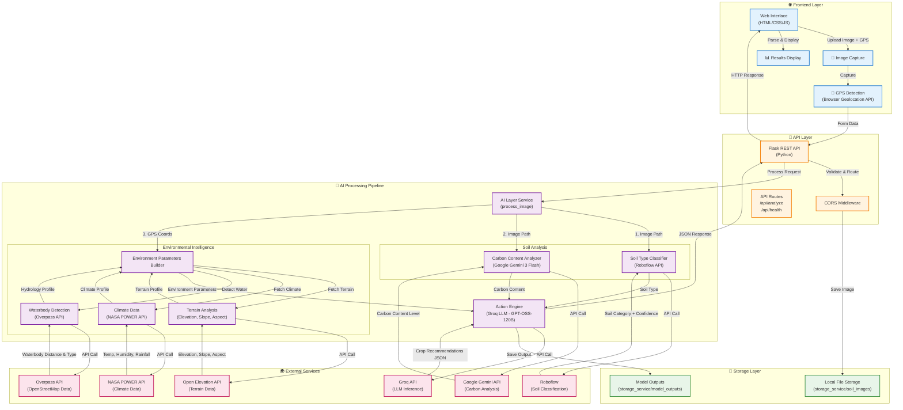
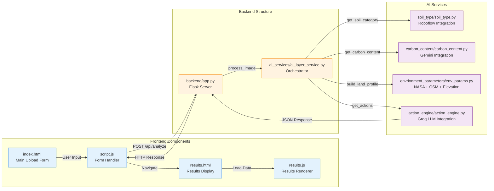
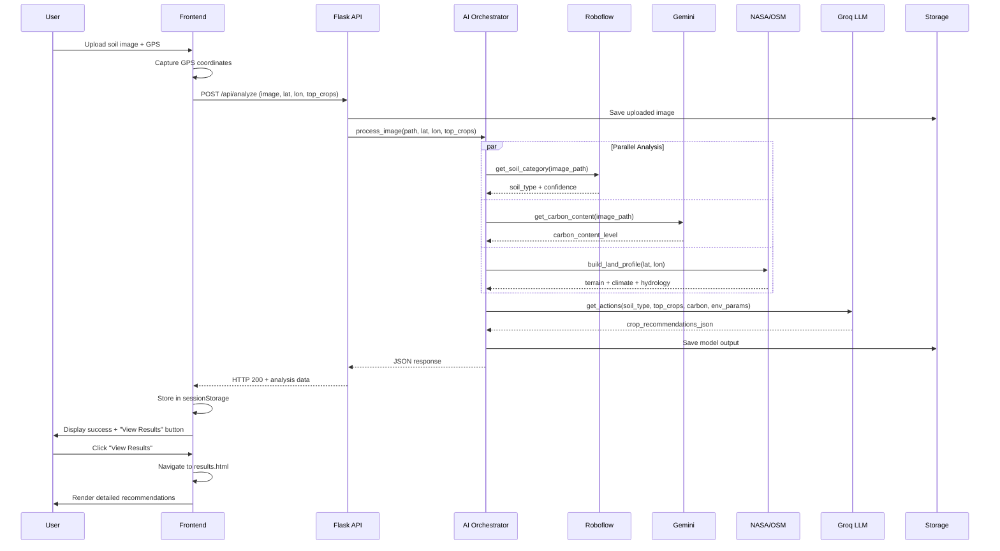

# Dharti---Drishti

[PPT](https://docs.google.com/presentation/d/1DIrdumShqwMI7SoRJPezvERtIQ_cikdc-K_2yvy8ow4/edit?usp=sharing)

## Current Architecture Diagram

## Detailed Component Architecture

## Data Flow Sequence

## Key Features & Capabilities

- **Instant Soil Analysis**: Upload soil image and get results in ~30 seconds
- **Multi-Model AI Pipeline**: Combines computer vision, LLM, and geospatial intelligence
- **GPS-Enhanced Recommendations**: Location-aware crop suggestions based on climate and terrain
- **Comprehensive Environmental Profiling**: Elevation, slope, aspect, rainfall, temperature, waterbody proximity
- **Actionable Insights**: Fertilizer recommendations, irrigation methods, month-by-month plans
- **Demo Mode**: Test with pre-loaded sample images
- **Responsive UI**: Works on desktop and mobile browsers

## System Components

### Frontend Layer
- **index.html**: Main upload interface with demo mode support
- **results.html**: Comprehensive results display page
- **script.js**: Handles form submission, GPS capture, and API communication
- **results.js**: Renders detailed crop recommendations and analysis

### API Layer
- **Flask REST API**: Handles HTTP requests and orchestrates processing
- **Endpoints**:
  - `POST /api/analyze`: Main analysis endpoint
  - `GET /api/health`: Health check endpoint
  - `GET /storage_service/soil_images/<filename>`: Serve demo images

### AI Processing Pipeline
1. **Soil Type Classification** (Roboflow): Identifies soil texture and type
2. **Carbon Content Analysis** (Gemini): Estimates organic carbon levels from image
3. **Environmental Intelligence** (NASA/OSM/Elevation APIs):
   - Terrain: Elevation, slope, aspect direction
   - Climate: Temperature, humidity, rainfall patterns
   - Hydrology: Nearby waterbodies and distance
4. **Action Engine** (Groq LLM): Generates actionable farming recommendations

### Storage Layer
- **soil_images/**: Stores uploaded and demo soil images
- **model_outputs/**: Saves timestamped LLM responses for audit trail

## API Integration Details

| Service | Purpose | Data Provided |
|---------|---------|---------------|
| **Roboflow** | Soil classification | Soil type (Alluvial, Clay, Sandy, etc.) + confidence score |
| **Google Gemini** | Carbon analysis | Organic carbon content level from visual analysis |
| **NASA POWER** | Climate data | Temperature, humidity, rainfall, dew point (annual data) |
| **Open Elevation** | Terrain analysis | Elevation, slope degree/percent, aspect direction |
| **Overpass (OSM)** | Waterbody detection | Distance to nearest water source, waterbody type |
| **Groq** | Recommendation engine | Structured JSON with crop suggestions, fertilizers, schedules |

## Processing Flow

1. User uploads soil image with GPS coordinates
2. Flask API saves image and initiates processing
3. Parallel AI analysis:
   - Roboflow classifies soil type
   - Gemini analyzes carbon content
   - NASA/OSM/Elevation APIs build environmental profile
4. Groq LLM synthesizes all data into actionable recommendations
5. Results stored and returned to frontend
6. Frontend displays comprehensive farming guidance

## Output Structure

The system generates detailed recommendations including:
- **Summary**: Overview of soil condition and suitability
- **Land Preparation**: Pre-planting soil amendments
- **Crop Recommendations**: Top N crops with:
  - Expected harvest and growing days
  - Planting and harvest times
  - Fertilizer schedule (before planting + during growth)
  - Watering guide with critical stages
  - Month-by-month task plan
  - Common problems and solutions
  - Harvest tips
- **General Tips**: Soil protection, water saving, cost optimization
- **Rotation Plan**: Multi-year crop rotation strategy
